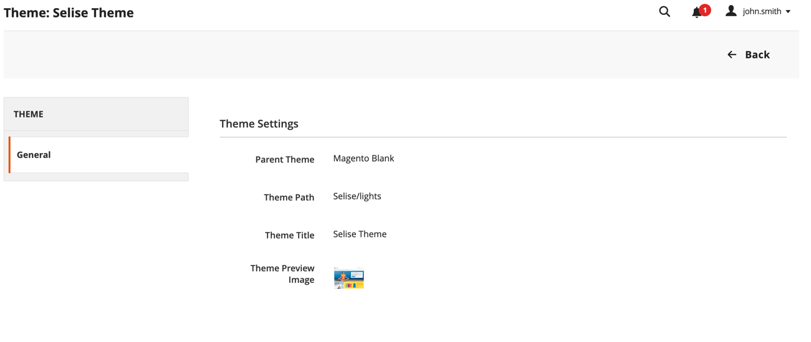
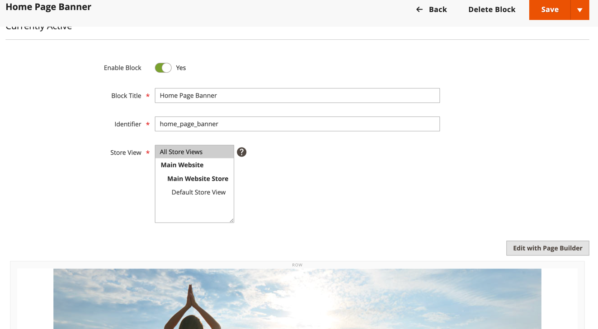
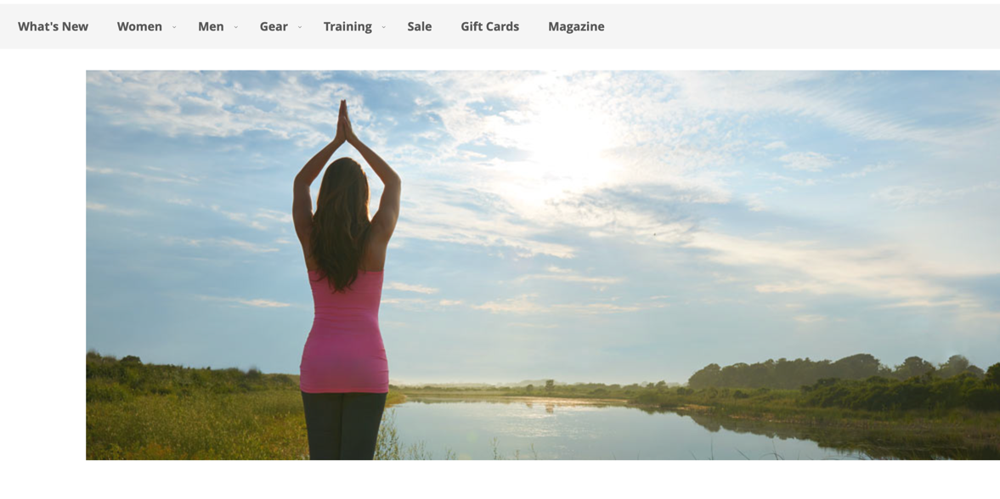

# List of Assessment Topic's Answer in Nutshell

## Install latest version of magento2 (nginx or apache)

> While development did install & configure the latest version of Magento 2 with Nginx & with all other needed stack to run magento development environment

## Create new custom news including news category

> Did create a blog/news (in my case i give it name as magazine, considering this is an beauty product website, so mgazine is convenient)
> 
> Build a complete blog module with all those functionally within short period of time is impossible unless you copy code or generate code. I try to do it from scratch. So don't able to complete
> full function rather try to touch every part. Like,
> - Create / Delete / Update
> - Rest API for frontend
> - Menu in Storefront
> - List of Post show
> - And with all magento standard ACL & Menu / Configuration
> 
> Note : Details documentation will be found on _**Readme_Magazine.md**_

## Create a new child theme

> A child theme is created named Selise_lights

> Note : Before doing anything related to theme, you have to choose the theme from admin panel. By default magento choose default theme.

### In home page add static banner using xml

> Create a block from admin cms block named **home_page_banner**

> Now Whatever you put will show in home page as banner in top

> On storefront it will looks like this for example

### Add promo block witch link to different category/product

> If i understand properly, we don't need to anything programmatically to achive this, this is content work, can done easily from admin panel for each page, category.

> If not understand properly, by clarifying that can be doable

### Add new block for feature product

> This is also same can be done from admin cms option and page builder. We probably don't need to code programmatically.

### In the product list page add static text before price. (Like 10% off)

> I don't get time to do this. But this can be done two way if you want to do that for all product listing then copy the product list file from parent then and add a static text before where pricing is showing.

> But if you want manage those text a static block can get added.

# Last thing how to install :

> Just copy the code and add in you app directory.