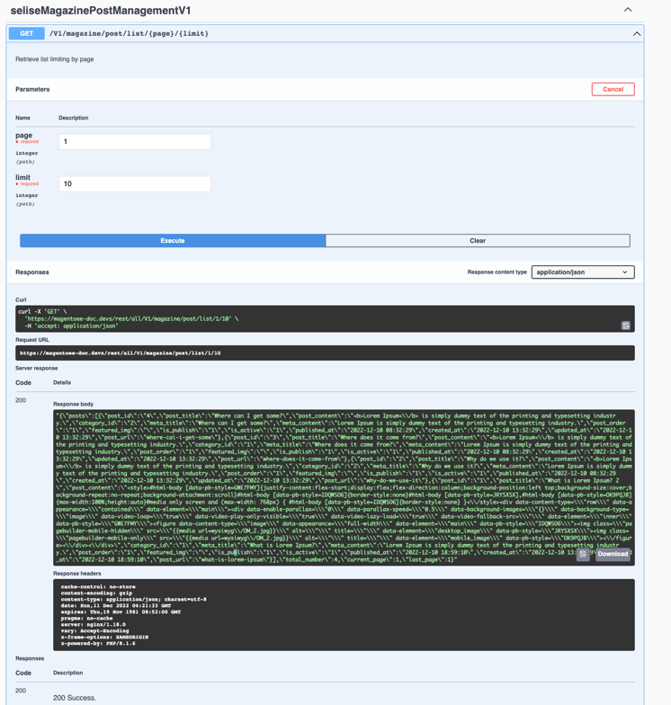
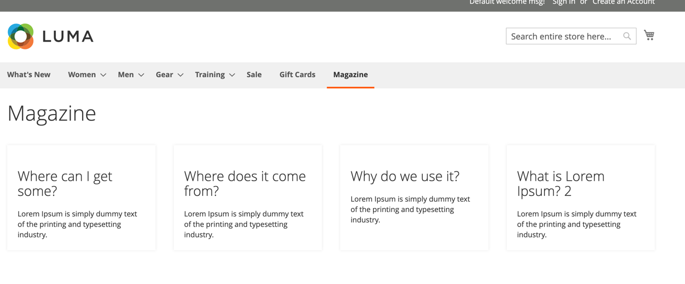

## Magazine Feature

> I said earlier to complete a perfect Blog module should take time if you are not follow dirty way, because for building this you have to touch entire magento feature.
> But i tried build something from scratch and try to touch every part a little bit without completing it.

### For API : 

> URL : https://magento-store-url.com/rest/all/V1/magazine/post/list/1/10

> You will get list of post with all data

> Also you can found an api

> URL : https://magento-store-url.com/swagger 
> 
> Where you can try with API.

>  

### On Frontend it will show something like

>  

### From Admin Panel you can manage both post and category, and for content Page builder added.

## Improvement area

- As i said it's minimal implementation of the module feature.
- So there are lot's of area for improvement